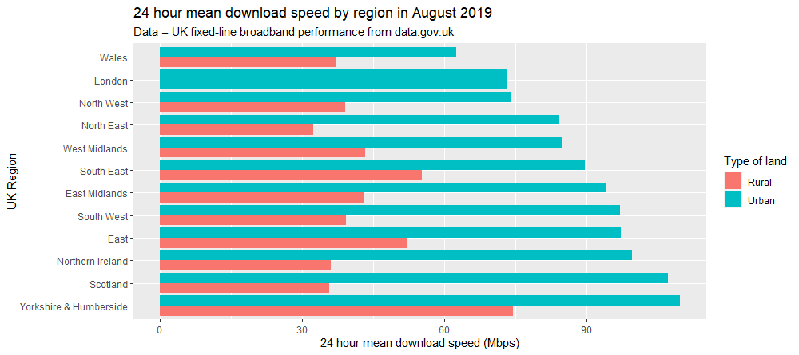
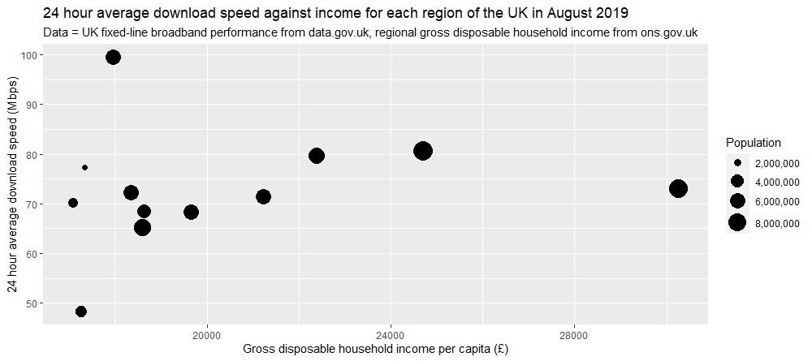

```{r load-packages, include = FALSE}
# Add any additional packages you need to this chunk
library(xaringan)
library(tidyverse)
library(knitr)
library(xaringanthemer)
```

```{r setup, include=FALSE}
# For better figure resolution
knitr::opts_chunk$set(fig.retina = 3, dpi = 300, fig.width = 6, fig.asp = 0.618, out.width = "80%")
```

```{r load-data, include=FALSE}
# Load your data here
feb2019 <- read_csv("broadband_data_february_2019.csv")
aug2019 <- read_csv("broadband_data_august_2019.csv")
```

```{r include=FALSE}

```

class: inverse, center, middle

## Introduction

---

class: center, middle

# Does geographical location and characteristics have an effect on internet quality of life in the UK and how has this changed over time?

---

# Our Datasets

We will be using the following:

 - UK fixed line broadband performance Feb 2019

 - UK fixed line broadband performance Aug 2019

https://www.data.gov.uk/dataset/dfe843da-06ca-4680-9ba0-fbb27319e402/uk-fixed-line-broadband-performance


---

# Data

 - From: data.gov.uk

 - Collected by: Ofcom’s research on the consumer experience
 
---
#February 2019 Data

```{r glimpse feb}
glimpse(feb2019)
```

---
#August 2019 Data

```{r glimpse aug}
glimpse(aug2019)
```

---
class: inverse, center, middle

## Data Analysis Plan

---
# Variables we will use (for now)

 - Region and Country 
 - "Urban Rural"
 - 24 Hour Average / Minimum / Maximum Download Speeds
 - 24 Hour Average / Minimum / Maximum Upload Speeds
 - Peak Speeds for the above (Peak Average Download, etc.)
 - Netflix / iPlayer / Youtube 24 Hour Average Speeds - HD and SD

---
# Comparison Groups

We will be comparing February and August 2019

---
# Initial Visualisations - download speed by region
```{r viz1, echo = FALSE, out.width = "90%", fig.align = "center"}

```
---

# Initial Visualisations - download speed by regional income
```{r viz2, echo = FALSE, out.width = "90%", fig.align = "center"}

```
---

# Statistics we believe will be useful

---

class: inverse, center, middle

## Thank You

---
